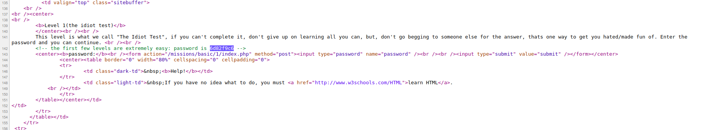
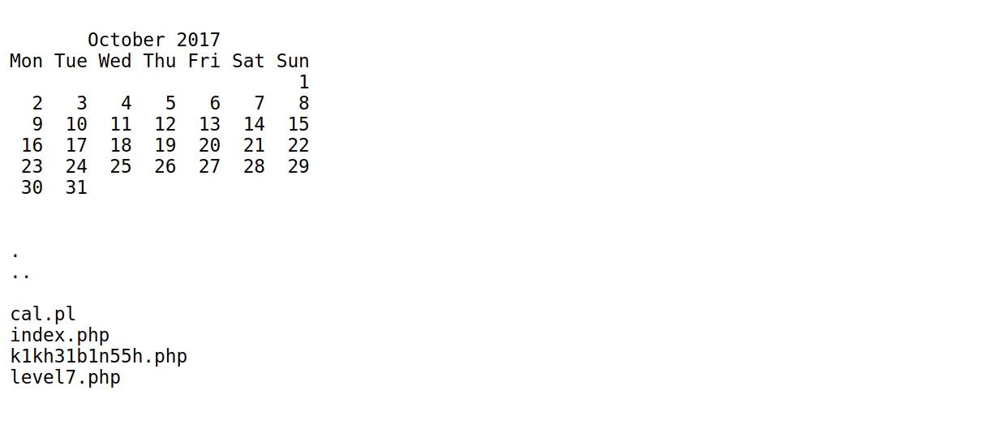
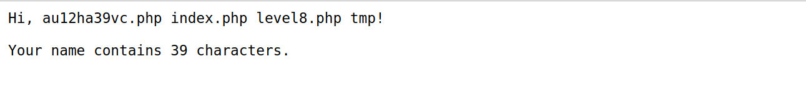

# Basic Missions

### Mission 1

Challenge link [here](https://www.hackthissite.org/missions/basic/1/)

Very simple. Just read the source code and get the password.



Password = **6d82f9c6**

----

### Mission 2

Challenge link [here](https://www.hackthissite.org/missions/basic/2/)

Since password file is not uploaded just click submit with blank text to complete this mission.

----

### Mission 3 

Challenge link [here](https://www.hackthissite.org/missions/basic/3/)

Looking at the source code near form field, there is a hidden file input with value *password.php*. Opening password.php from browser gives away the password.

Password = **aaf85ae6**

----

### Mission 4

Challenge link [here](https://www.hackthissite.org/missions/basic/4/)

In the hidden input, email form field just change the value of the default email to your email. Then the remainder of the password has been sent to your email. 

Password = **252903de**

----

### Mission 5

Challenge link [here](https://www.hackthissite.org/missions/basic/5/)

Same as above.

Password = **fae5169e**

----

### Mission 6

Challenge link [here](https://www.hackthissite.org/missions/basic/6/)

I did some hit and trials to understand the encryption method.

| Input    | Encrypted |
|--------  |-------    |
| password | pbuv{txk  |
| flapjack | fmcsnfir  |
| puzzlers | pv|}pjxz  |

The encryption is simple.

Let x and y be the letters of original and encrypted message at position n respectively. Then,

y = chr(ord(x)+n)

Python helps me to recover the original password.

```python

s = '432i:7g9'
d = ''
for n in range(len(s)) :
	d += chr(ord(s[n])-n)
print d

```

Password = **420f62a2**

----

### Mission 7

Challenge link [here](https://www.hackthissite.org/missions/basic/7/)

As said by the question there our input returns the output from the UNIX cal command. We know that the password for this level is saved in some file in the same directory. Therefore we need to input **; ls** as payload. The **semicolon(;)** terminates the previous command **cal** and **ls** is used to list files in the directory.



We saw a stranger file *k1kh31b1n55h.php*. Read the content of the file from your browser to get the password. 

Password = **d723d108**

----

### Mission 8

Challenge link [here](https://www.hackthissite.org/missions/basic/8/)

After learning about SSI from [Wikipedia](https://en.wikipedia.org/wiki/Server_Side_Includes) and [OWASP](https://www.owasp.org/index.php/Main_Page). Then clearly our payload will be

```

<!--#exec cmd="ls .." -->

```



We saw a stranger file *au12ha39vc.php*. Read the content of the file from your browser to get the password.

Password = **83e0172c**

----