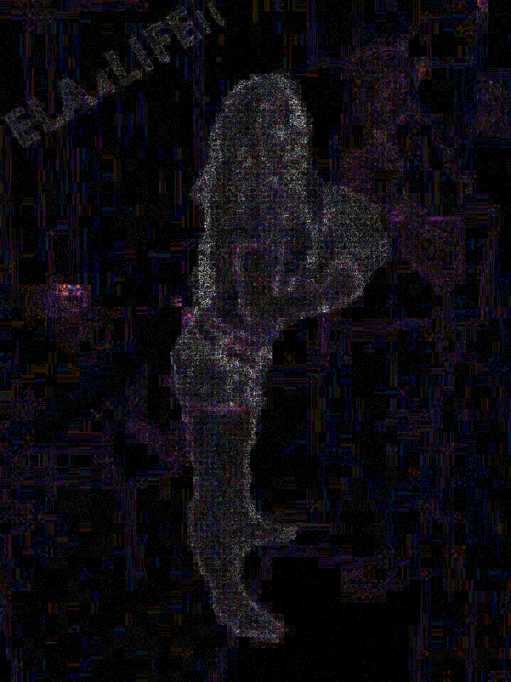

# Forensics Missions

### Mission 1

Challenge link [here](https://www.hackthissite.org/missions/forensic/1/)

In this challenge, we have to recover the deleted files from the [disk image](files/image.dd). I use [AccessData FTK Imager](http://accessdata.com/) software to mount the disk image. In a Linux system deleted files are stored in a hidden folder **.Trash-1000**. Inside this folder, there is a lot of files and a strange looking folder named private. Inside the private folder there is a password protected Rar archive named [Your new password is.rar](files/image-files-of-level-1/[root]/.Trash-1000/expunged/2026288587/private/Your-new-password-is.rar). Now looking for more information I found this [voicemail](files/image-files-of-level-1/[root]/.Trash-1000/expunged/2026288587/Voicemail-1.wav). It says 'Hi Stacy, I message a new key over to you. Use your phone number to access the file'. Now I know that the password the archive is Stacy's phone number. After more searching, I found a [doc](files/image-files-of-level-1/[root]/.Trash-1000/expunged/2026288587/Termination-Allen-Smith.docx) containing Stacy phone number.

The password of the archive is **5195554783**.

Using this password to extract the archive we got the password of this level.

Password = **qPYgbs0w5&?i{8a**

----

### Mission 2

Challenge link [here](https://www.hackthissite.org/missions/forensic/2/)

As mentioned in the challenge statement that the image has been manipulated. So I use [this](https://29a.ch/photo-forensics/#error-level-analysis) online forensic tool to check for Error Level Analysis.

After this, we conclude that this image is manipulated and the woman is not present in actual image. We are also able to read the password for this level.

Password = **ELA4LIFE!!**

----

### Mission 3

Challenge link [here](https://www.hackthissite.org/missions/forensic/3/)

Status = UNSOLVED :weary:

