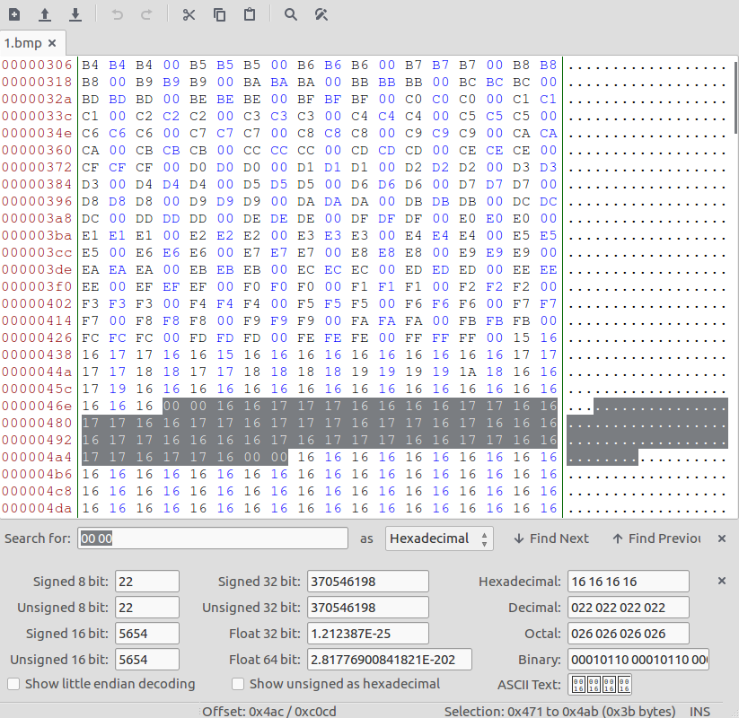
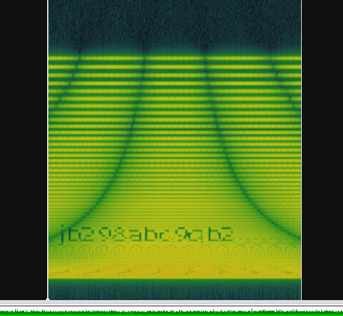
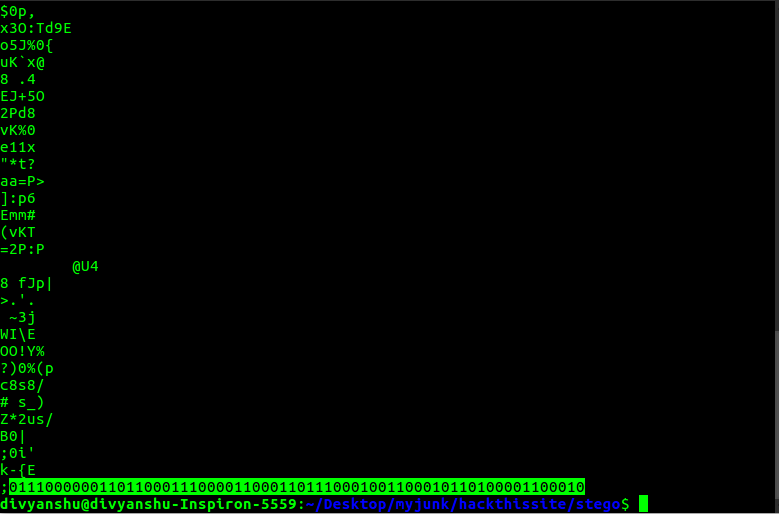
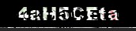
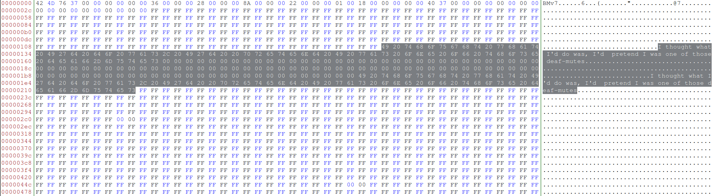
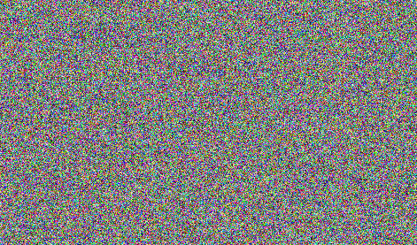
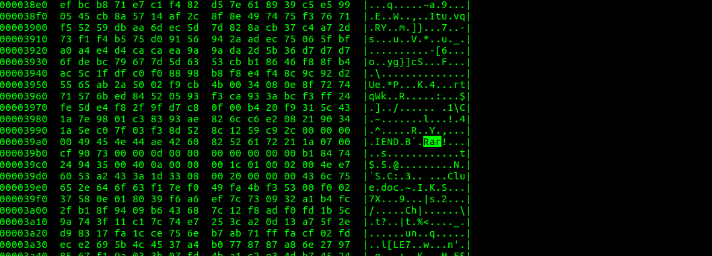
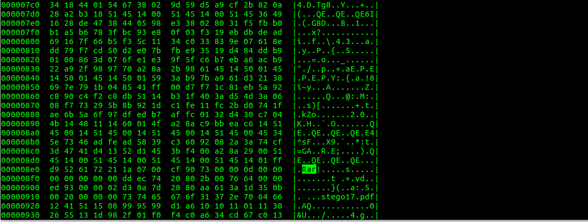
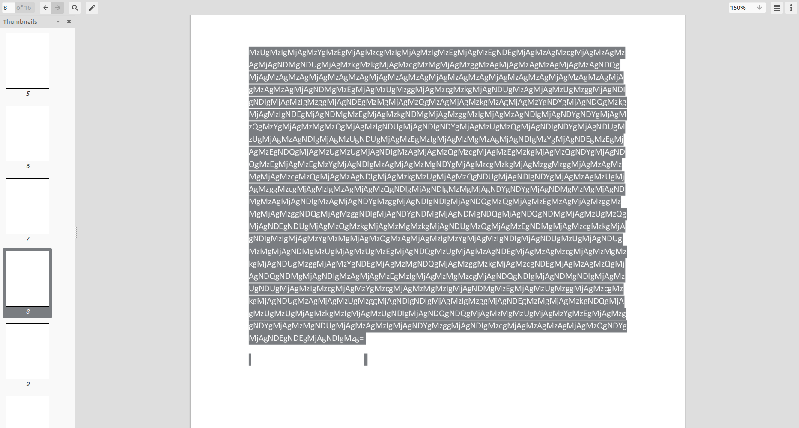

# Stego Missions

### Mission 1

Challenge link [here](https://www.hackthissite.org/missions/playit/stego/1)


**HINT**: This is an encoded message, the only tip you get is '2 null bytes'

The mission hint suggests that we have to look at two null bytes(00 00).
On opening the file with hex-editor, we saw the series of **16** and **17** between two null-bytes.

 

It reminds me of binary and I consider 16 as 0 and 17 as 1. But the string length is 55 which is not the multiple of 8. As we know that every 8-bit binary digits represent one ASCII character. Therefore one bit is missing. After some hit and trials, I found that the missing bit is the trailing 0 of the first character. Now after decoding the binary we get the password.

| binary | char |
|--------|------|
|00111000|8|
|00110011|3|
|00110111|7|
|01101000|h|
|01100001|a|
|01110011|s|
|00110110|6|

Password = **837has6**

----

### Mission 2

Challenge link [here](https://www.hackthissite.org/missions/playit/stego/2)

This time we are given with an audio [file](files/2.wav). On opening the audio file with [Sonic Visualiser](http://www.sonicvisualiser.org/) and adding spectrogram layer, gives away the password.

 

Password = **jb298abc9qb2** 

----

### Mission 3

Challenge link [here](https://www.hackthissite.org/missions/playit/stego/3)


**HINT**: Look carefully: it's obvious, just not at first sight.

As the question suggests, I wrote the python script to extract RGB values of every pixel. On observing, I found that the RGB value of most of the pixels is (62,62,62) but some of the pixels are slightly different having RGB values as (61,62,62). Then with the help of the python, I changed the RGB value of those pixels to (255,255,255). The resulting image gives away the password.

```python

from PIL import Image

im =Image.open('3.bmp','r')

pix = im.load()
width,height = im.size

for i in range(height) :
	for j in range(width) :
		r,g,b = pix[j,i]
		if r != 62 :
			pix[j,i] = 255,255,255

im.save('3solved.bmp')

```


Password = **n38f298hsjf**

----

### Mission 4

Challenge link [here](https://www.hackthissite.org/missions/playit/stego/4)


**HINT**: I am being hexed!.

I just pass the strings command through the image and see the binary digits at the end.



I use the python script to convert from binary to ASCII.

```python

s = '0111000000110110001110000110001101110001001100010110100001100010'

char = ''
password = ''

for i in range(len(s)/8) :
	char = s[:8] 
	password += chr(int(char,2))
	s = s[8:]

print password

```

Password = **p68cq1hb**

----

### Mission 5

Challenge link [here](https://www.hackthissite.org/missions/playit/stego/5)


Status = UNSOLVED :weary:

----

### Mission 6

Challenge link [here](http://www.hackthissite.org/missions/playit/stego/6)


Same as mission 4.


This time we get base64 encoded string at the end of the image. I wrote the python script to decode it.

```python

import base64
s = 'Tm90IGxpa2UgaXQncyBoYXJkIHRvICdkZWNyeXB0JyB0aGlzIGh1aD8gVGhlIHBhc3N3b3JkIGlzIGhnYnZadzA3Lg=='
print base64.b64decode(s)

```

Result = Not like it's hard to 'decrypt' this huh? The password is hgbvZw07.

Password = **hgbvZw07**

----

### Mission 7

Challenge link [here](http://www.hackthissite.org/missions/playit/stego/7)


I use photoshop to solve this challenge. After opening the image in adobe photoshop, I saw that the image has three layers. Deleting the layer 1 gives away the readable password image.



Password = **4aH5CEta**

----

### Mission 8

Challenge link [here](http://www.hackthissite.org/missions/playit/stego/8)


Same as mission 4 and 6. But this time I pass image through hd command as output of strings command is empty because default min-lenght for string in strings command is 4.


Password = **YrRot7**

----

### Mission 9

Challenge link [here](http://www.hackthissite.org/missions/playit/stego/9)

Audio [file](files/9.wav)

On analyzing the audio file the same way I did in mission 2 with [sonic visualiser](http://www.sonicvisualiser.org/), I saw some small dash and large dash. This gives the hint towards [Morse Code](https://en.wikipedia.org/wiki/Morse_code). Taking small dash as a dot(.), large dash as (-), small space as space and large space as (/). On decoding, we get the following Morse code.


```

.---- ----- --... / ..... -.... / .---- ..--- ----- / ....- ---.. / .---- .---- ----. / ..... ...-- / ----. ---.. / ----. ---.. / .---- .---- --... / .---- .---- ...--

``` 

I use [this](https://morsecode.scphillips.com/translator.html) online tool to decode the morse code.

***OUTPUT*** = 107 56 120 48 119 53 98 98 117 113

Thinking of each decimal as their respective ASCII character I get the password.

Password = **k8x0w5bbuq**

----

### Mission 10

Challenge link [here](https://www.hackthissite.org/missions/playit/stego/10)


In given image we see some normal letters and some **bold** letters. This arrangement is similar to [Bacon Code](https://en.wikipedia.org/wiki/Bacon%27s_cipher). Now we just need to replace the bold letters with 'b' and normal letters with 'a'.

```

baabb aabbb aabaa abbbb aaaaa baaba baaba babba abbba baaab aaabb abaaa baaba abbab abbba baabb aabbb aabaa baaab aabaa

```

I use [this](https://mothereff.in/bacon) online tool with version 2 to decode the cipher.

***RESULT*** = T H E P A S S W O R D I S N O T H E R E

Password = **nothere**

----

### Mission 11

Challenge link [here](https://www.hackthissite.org/missions/playit/stego/11)


Status = UNSOLVED :weary:

----

### Mission 12

Challenge link [here](https://www.hackthissite.org/missions/playit/stego/12)


On analyzing every pixel the same way i did in mission 3, I found the series of integers. After some time, I was able to extract a zip file from this series of integers. I wrote the following python script.

```python

from PIL import Image

im = Image.open('12.bmp','r')
width,height = im.size

pix = im.load()
text = ''

for i in range(height) :
	for j in range(width) :
		n = pix[j,i]
		text += chr(255-n)

f = open('12.zip','w')
f.write(text)
f.close()

```

Extracting the zip file gives away the password.

Password = **6ae4nt5TB**

----

### Mission 13 

Challenge link [here](https://www.hackthissite.org/missions/playit/stego/13)


On looking the file in [hex-editor](https://apps.ubuntu.com/cat/applications/natty/bless/), I saw that there is a lot of junk message added inside the image.



Deleting every occurrence of these junk messages gives a newly readable image.


Password = **acf42hvx10**

----

### Mission 14

Challenge link [here](https://www.hackthissite.org/missions/playit/stego/14)


On looking through the hex-dump of the image, I found that there is Rar archive inisde the image.


I use [binwalk](https://github.com/devttys0/binwalk) to extract the data from the image. The Rar gives *key.jpg*. After some googling I found that this it was [Affine cipher](https://en.wikipedia.org/wiki/Affine_cipher).

 

Cipher = PGNNZCFYXD

Key --> a = 5 and b = 10

I use [this](http://www.dcode.fr/affine-cipher) online tool to decrypt the cipher.

Password = **bulldozinj**

----

### Mission 15

Challenge link [here](https://www.hackthissite.org/missions/playit/stego/15)



Status = UNSOLVED :weary:

----

### Mission 16

Challenge link [here](https://www.hackthissite.org/missions/playit/stego/16)


Status = UNSOLVED :weary:

Looking at the hex-dump of the image, I found that there is a Rar archive hidden inside the image.



On extracting the archive through [binwalk](https://github.com/devttys0/binwalk) I got the password protected [archive](16solved.rar) containing a document *clue.doc*. I was unable to get the password of the archive to read the document. :weary:

----

### Mission 17

Challenge link [here](https://www.hackthissite.org/missions/playit/stego/17)


Status = UNSOLVED :weary:

Again looking at the hex-dump of the image, I found the hidden Rar [archive](files/17solved2.rar) and extract it using [binwalk](https://github.com/devttys0/binwalk).



Inside archive, there is a [pdf](files/17solved3.pdf) file of 16 pages all white. Thinking of white color font, I found a base64 encrypted message on page 8.



```

MzUgMzIgMjAgMzYgMzEgMjAgMzcgMzIgMjAgMzIgMzEgMjAgMzEgNDEgMjAgMzAgMzcgMjAgMzAgMzAgMjAgNDMgNDUgMjAgMzkgMzkgMjAgMzcgMzMgMjAgMzggMzAgMjAgMzAgMzAgMjAgMzAgNDQgMjAgMzAgMzAgMjAgMzAgMzAgMjAgMzAgMzAgMjAgMzAgMzAgMjAgMzAgMzAgMjAgMzAgMzAgMjAgMzAgMzAgMjAgNDMgMzEgMjAgMzUgMzggMjAgMzcgMzkgMjAgNDUgMzAgMjAgMzUgMzggMjAgNDIgNDIgMjAgMzIgMzggMjAgNDEgMzMgMjAgMzQgMzAgMjAgMzkgMzAgMjAgMzYgNDYgMjAgNDQgMzkgMjAgMzIgNDEgMjAgNDMgMzEgMjAgMzkgNDMgMjAgMzggMzIgMjAgMzAgNDIgMjAgNDYgNDYgMjAgMzQgMzYgMjAgMzMgMzQgMjAgMzIgNDUgMjAgNDIgNDYgMjAgMzUgMzQgMjAgNDIgNDYgMjAgNDUgMzUgMjAgMzAgNDIgMjAgMzUgNDUgMjAgMzEgMzIgMjAgMzMgMzAgMjAgNDIgMzYgMjAgNDEgMzEgMjAgMzEgNDQgMjAgMzUgMzUgMjAgNDIgMzAgMjAgMzQgMzcgMjAgMzEgMzkgMjAgMzQgNDYgMjAgNDQgMzEgMjAgMzEgMzYgMjAgNDIgMzAgMjAgMzMgNDYgMjAgMzcgMzkgMjAgMzggMzggMjAgMzAgMzMgMjAgMzcgMzQgMjAgMzAgNDIgMjAgMzkgMzUgMjAgMzQgNDUgMjAgNDIgNDYgMjAgMzAgMzUgMjAgMzggMzcgMjAgMzIgMzAgMjAgMzQgNDIgMjAgNDIgMzMgMjAgNDYgNDYgMjAgNDMgMzMgMjAgNDMgMzAgMjAgNDIgMzAgMjAgNDYgMzggMjAgNDIgNDIgMjAgNDQgMzQgMjAgMzEgMzAgMjAgMzggMzMgMjAgMzggNDQgMjAgMzggNDIgMjAgNDYgNDMgMjAgNDMgNDQgMjAgNDQgNDMgMjAgMzUgMzQgMjAgNDEgNDUgMjAgMzQgMzkgMjAgMzMgMzkgMjAgNDUgMzQgMjAgMzEgNDMgMjAgMzcgMzkgMjAgNDIgMzIgMjAgMzYgMzMgMjAgMzQgMzAgMjAgMzIgMzYgMjAgMzIgNDIgMjAgNDUgMzUgMjAgNDUgMzMgMjAgNDMgMzUgMjAgMzUgMzEgMjAgNDQgMzUgMjAgMzAgNDEgMjAgMzAgMzcgMjAgMzMgMzkgMjAgNDUgMzggMjAgMzYgNDEgMjAgMzMgNDQgMjAgMzggMzkgMjAgMzcgNDEgMjAgMzAgMzQgMjAgNDQgNDMgMjAgNDIgMzAgMjAgMzEgMzIgMjAgMzMgMzcgMjAgNDQgNDIgMjAgNDMgNDIgMjAgMzUgNDUgMjAgMzIgMzcgMjAgMzYgMzcgMjAgMzMgMzIgMjAgNDMgMzEgMjAgMzUgMzggMjAgMzcgMzkgMjAgNDUgMzAgMjAgMzUgMzggMjAgNDIgNDIgMjAgMzIgMzggMjAgNDEgMzMgMjAgMzkgNDQgMjAgMzUgMzUgMjAgMzkgMzIgMjAgMzUgNDIgMjAgNDQgNDQgMjAgMzMgMzUgMjAgMzYgMzEgMjAgMzggNDYgMjAgMzMgNDUgMjAgMzAgMzIgMjAgNDYgMzggMjAgNDIgMzcgMjAgMzAgMzAgMjAgMzQgNDYgMjAgNDEgNDEgMjAgNDIgMzg=

```

After [decoding](http://www.asciitohex.com/) it 

```

35 32 20 36 31 20 37 32 20 32 31 20 31 41 20 30 37 20 30 30 20 43 45 20 39 39 20 37 33 20 38 30 20 30 30 20 30 44 20 30 30 20 30 30 20 30 30 20 30 30 20 30 30 20 30 30 20 30 30 20 43 31 20 35 38 20 37 39 20 45 30 20 35 38 20 42 42 20 32 38 20 41 33 20 34 30 20 39 30 20 36 46 20 44 39 20 32 41 20 43 31 20 39 43 20 38 32 20 30 42 20 46 46 20 34 36 20 33 34 20 32 45 20 42 46 20 35 34 20 42 46 20 45 35 20 30 42 20 35 45 20 31 32 20 33 30 20 42 36 20 41 31 20 31 44 20 35 35 20 42 30 20 34 37 20 31 39 20 34 46 20 44 31 20 31 36 20 42 30 20 33 46 20 37 39 20 38 38 20 30 33 20 37 34 20 30 42 20 39 35 20 34 45 20 42 46 20 30 35 20 38 37 20 32 30 20 34 42 20 42 33 20 46 46 20 43 33 20 43 30 20 42 30 20 46 38 20 42 42 20 44 34 20 31 30 20 38 33 20 38 44 20 38 42 20 46 43 20 43 44 20 44 43 20 35 34 20 41 45 20 34 39 20 33 39 20 45 34 20 31 43 20 37 39 20 42 32 20 36 33 20 34 30 20 32 36 20 32 42 20 45 35 20 45 33 20 43 35 20 35 31 20 44 35 20 30 41 20 30 37 20 33 39 20 45 38 20 36 41 20 33 44 20 38 39 20 37 41 20 30 34 20 44 43 20 42 30 20 31 32 20 33 37 20 44 42 20 43 42 20 35 45 20 32 37 20 36 37 20 33 32 20 43 31 20 35 38 20 37 39 20 45 30 20 35 38 20 42 42 20 32 38 20 41 33 20 39 44 20 35 35 20 39 32 20 35 42 20 44 44 20 33 35 20 36 31 20 38 46 20 33 45 20 30 32 20 46 38 20 42 37 20 30 30 20 34 46 20 41 41 20 42 38

```

Considering above numbers as hexadecimal, decoding this as hex

```

52 61 72 21 1A 07 00 CE 99 73 80 00 0D 00 00 00 00 00 00 00 C1 58 79 E0 58 BB 28 A3 40 90 6F D9 2A C1 9C 82 0B FF 46 34 2E BF 54 BF E5 0B 5E 12 30 B6 A1 1D 55 B0 47 19 4F D1 16 B0 3F 79 88 03 74 0B 95 4E BF 05 87 20 4B B3 FF C3 C0 B0 F8 BB D4 10 83 8D 8B FC CD DC 54 AE 49 39 E4 1C 79 B2 63 40 26 2B E5 E3 C5 51 D5 0A 07 39 E8 6A 3D 89 7A 04 DC B0 12 37 DB CB 5E 27 67 32 C1 58 79 E0 58 BB 28 A3 9D 55 92 5B DD 35 61 8F 3E 02 F8 B7 00 4F AA B8

```

again decoding as hex

```

Rar!\x1a\x07\x00\xce\x99s\x80\x00\r\x00\x00\x00\x00\x00\x00\x00\xc1Xy\xe0X\xbb(\xa3@\x90o\xd9*\xc1\x9c\x82\x0b\xffF4.\xbfT\xbf\xe5\x0b^\x120\xb6\xa1\x1dU\xb0G\x19O\xd1\x16\xb0?y\x88\x03t\x0b\x95N\xbf\x05\x87 K\xb3\xff\xc3\xc0\xb0\xf8\xbb\xd4\x10\x83\x8d\x8b\xfc\xcd\xdcT\xaeI9\xe4\x1cy\xb2c@&+\xe5\xe3\xc5Q\xd5\n\x079\xe8j=\x89z\x04\xdc\xb0\x127\xdb\xcb^'g2\xc1Xy\xe0X\xbb(\xa3\x9dU\x92[\xdd5a\x8f>\x02\xf8\xb7\x00O\xaa\xb8

```

This gives the hint of Rar archive. Converting it back to [Rar archive](files/17solved5.rar) gives a password protected archive. I was unable to guess the password of the archive. :weary:

