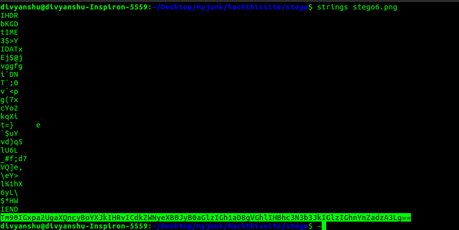
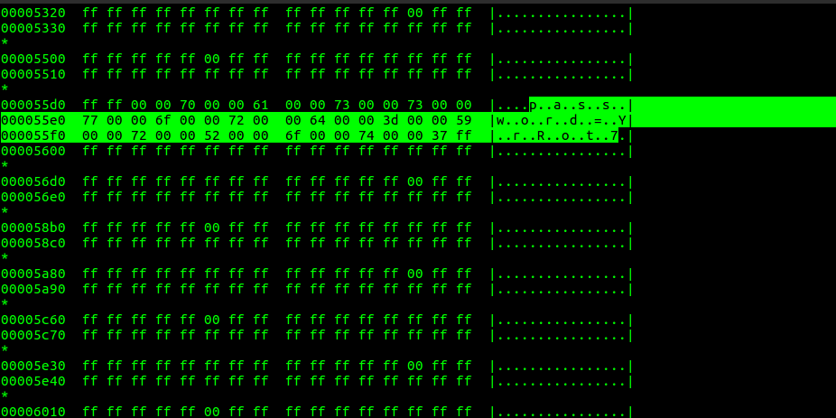
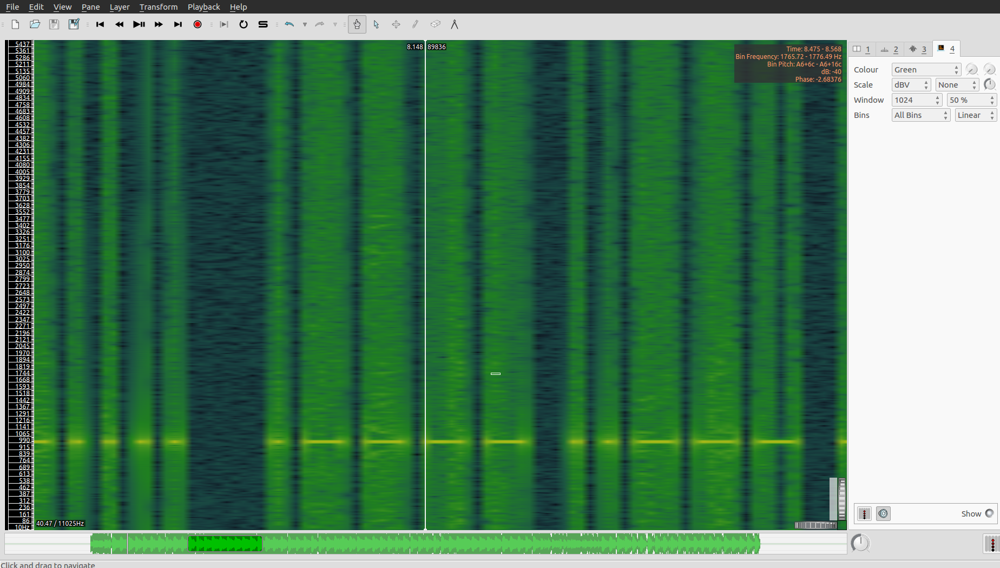

# Stego Missions

### Mission 1

Challenge link [here](https://www.hackthissite.org/missions/playit/stego/1)


**HINT**: This is an encoded message, the only tip you get is '2 null bytes'

The mission hint suggests that we have to look at two null bytes(00 00).
On opening the file with hex-editor, we saw the series of **16** and **17** between two null-bytes.

 

It reminds me of binary and I consider 16 as 0 and 17 as 1. But the string length is 55 which is not the multiple of 8. As we know that every 8-bit binary digits represent one ASCII character. Therefore one bit is missing. After some hit and trials, I found that the missing bit is the trailing 0 of the first character. Now after decoding the binary we get the password.

| binary | char |
|--------|------|
|00111000|8|
|00110011|3|
|00110111|7|
|01101000|h|
|01100001|a|
|01110011|s|
|00110110|6|

Password = **837has6**

----

### Mission 2

Challenge link [here](https://www.hackthissite.org/missions/playit/stego/2)

This time we are given with audio [file](2.wav). On opening the audio file with [Sonic Visualiser](http://www.sonicvisualiser.org/) and adding spectrogram layer, gives away the password.

 

Password = **jb298abc9qb2** 

----

### Mission 3

Challenge link [here](https://www.hackthissite.org/missions/playit/stego/3)


**HINT**: Look carefully: it's obvious, just not at first sight.

As the question suggests, I wrote the python script to extract RGB values of every pixel. On observing, I found that the RGB value of most of the pixels is (62,62,62) but some of the pixels are slightly different having RGB values as (61,62,62). Then with the help of the python, I changed the RGB value of those pixels to (255,255,255). The resulting image gives away the password.

```python

from PIL import Image

im =Image.open('3.bmp','r')

pix = im.load()
width,height = im.size

for i in range(height) :
	for j in range(width) :
		r,g,b = pix[j,i]
		if r != 62 :
			pix[j,i] = 255,255,255

im.save('3solved.bmp')

```


Password = **n38f298hsjf**

----

### Mission 4

Challenge link [here](https://www.hackthissite.org/missions/playit/stego/4)


**HINT**: I am being hexed!.

I just pass the strings command through the image and see the binary digits at the end.


I use the python script to convert from binary to ASCII.

```python

s = '0111000000110110001110000110001101110001001100010110100001100010'

char = ''
password = ''

for i in range(len(s)/8) :
	char = s[:8] 
	password += chr(int(char,2))
	s = s[8:]

print password

```

Password = **p68cq1hb**

----

### Mission 5

Challenge link [here](https://www.hackthissite.org/missions/playit/stego/5)


Status = UNSOLVED :weary:

----

### Mission 6

Challenge link [here](http://www.hackthissite.org/missions/playit/stego/6)


Same as mission 4.



This time we get base64 encoded string at the end of the image. I wrote the python script to decode it.

```python

import base64
s = 'Tm90IGxpa2UgaXQncyBoYXJkIHRvICdkZWNyeXB0JyB0aGlzIGh1aD8gVGhlIHBhc3N3b3JkIGlzIGhnYnZadzA3Lg=='
print base64.b64decode(s)

```

Result = Not like it's hard to 'decrypt' this huh? The password is hgbvZw07.

Password = **hgbvZw07**

----

### Mission 7

Challenge link [here](http://www.hackthissite.org/missions/playit/stego/7)


Status = UNSOLVED :weary:

----

### Mission 8

Challenge link [here](http://www.hackthissite.org/missions/playit/stego/8)


Same as mission 4 and 6. But this time I pass image through hd command as output of strings command is empty because default min-lenght for string in strings command is 4.



Password = **YrRot7**

----

### Mission 9

Challenge link [here](http://www.hackthissite.org/missions/playit/stego/9)

Audio [file](9.wav)

On analyzing the audio file the same way I did in mission 2 with [sonic visualiser](http://www.sonicvisualiser.org/), I saw some small dash and large dash. This gives the hint towards [Morse Code](https://en.wikipedia.org/wiki/Morse_code). Taking small dash as a dot(.), large dash as (-), small space as space and large space as (/). On decoding, we get the following Morse code.



```

.---- ----- --... / ..... -.... / .---- ..--- ----- / ....- ---.. / .---- .---- ----. / ..... ...-- / ----. ---.. / ----. ---.. / .---- .---- --... / .---- .---- ...--

``` 

I use [this](https://morsecode.scphillips.com/translator.html) online tool to decode the morse code.

***OUTPUT*** = 107 56 120 48 119 53 98 98 117 113

Thinking of each decimal as their respective ASCII character I get the password.

Password = **k8x0w5bbuq**

----

### Mission 10

Challenge link [here](https://www.T H E P A S S W O R D I S N O T H E R Ehackthissite.org/missions/playit/stego/10)


In given image we see some normal letters and some **bold** letters. This arrangement is similar to [Bacon Code](https://en.wikipedia.org/wiki/Bacon%27s_cipher). Now we just need to replace the bold letters with 'b' and normal letters with 'a'.

```

BAABB AABBB AABAA ABBBB AAAAA BAABA BAABA BABBA ABBBA BAAAB AAABB ABAAA BAABA ABBAB ABBBA BAABB AABBB AABAA BAAAB AABAA

```

I use [this](https://mothereff.in/bacon) online tool with version 2 to decode the cipher.

***RESULT*** = T H E P A S S W O R D I S N O T H E R E

Password = **nothere**

----

### Mission 11

Challenge link [here](https://www.hackthissite.org/missions/playit/stego/11)


Status = UNSOLVED :weary:

