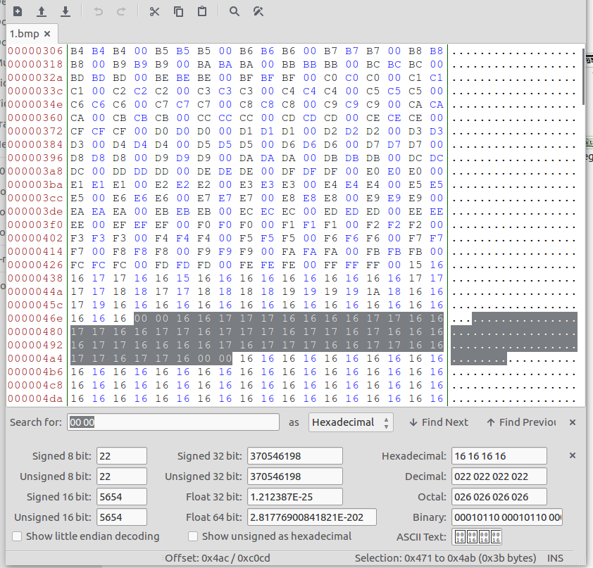

# Stego Missions

### Mission 1

Challenge link [here](https://www.hackthissite.org/missions/playit/stego/1)

**HINT**: This is an encoded message, the only tip you get is '2 null bytes'

The mission hint suggests that we have to look at two null bytes(00 00).
On opening the file with hex-editor, we saw the series of **16** and **17** between two null-bytes.

 

It reminds me of binary and I consider 16 as 0 and 17 as 1. But the string length is 55 which is not the multiple of 8. As we know that every 8-bit binary digits represent one ASCII character. Therefore one bit is missing. After some hit and trials, I found that the missing bit is the trailing 0 of the first character. Now after decoding the binary we get the password.

| binary | char |
|--------|------|
|00111000|8|
|00110011|3|
|00110111|7|
|01101000|h|
|01100001|a|
|01110011|s|
|00110110|6|

Password = **837has6**

----

### Mission 2

Challenge link [here](https://www.hackthissite.org/missions/playit/stego/2)

This time we are given with audio file. On opening the audio file with Sonic Visualiser and adding spectrogram layer, gives away the password.

 

Password = **jb298abc9qb2** 

----

### Mission 3

Challenge link [here](https://www.hackthissite.org/missions/playit/stego/3)

**HINT**: Look carefully: it's obvious, just not at first sight.

As the question suggests, I wrote the python script to extract RGB values of every pixel. On observing, I found that the RGB value of most of the pixels is (62,62,62) but some of the pixels are slightly different having RGB values as (61,62,62). Then with the help of the python, I changed the RGB value of thoses to (255,255,255). The resulting png gives away the flag.

Password = **n38f298hsjf**